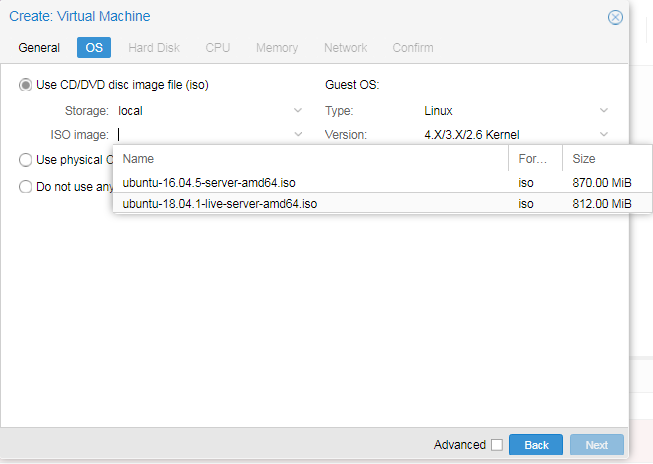
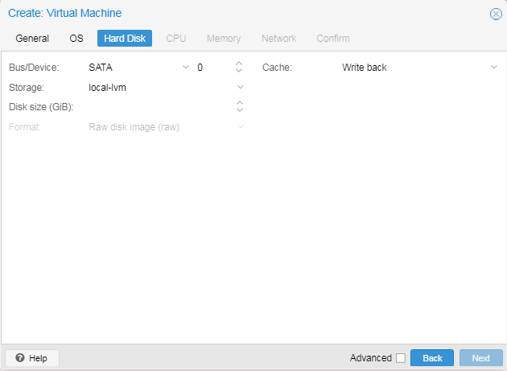
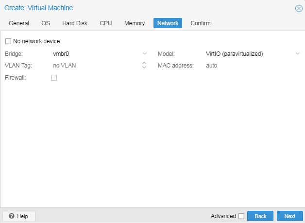

- [**backendSeed**](#--backendseed--)
- [**Configuración Proxmox y maquina virtual**](#--configuraci-n-proxmox-y-maquina-virtual--)
  * [**Maquina fisica Proxmox:**](#--maquina-fisica-proxmox---)
    + [**Administracion WEB**](#--administracion-web---)
    + [**Eliminar mensaje de alerta de subscripcion**](#--eliminar-mensaje-de-alerta-de-subscripcion--)
    + [**Instalar certificado Let’s Encrypt - ACME**](#--instalar-certificado-let-s-encrypt---acme--)
    + [**Restaurar certificados por defecto**](#--restaurar-certificados-por-defecto--)
    + [**Creación VM:**](#--creaci-n-vm---)
  * [**Maquina virtual Ubuntu**](#--maquina-virtual-ubuntu--)
    + [**Usuarios**](#--usuarios--)
    + [**SHH: Permitir/Denegar ingreso remoto a usuarios**](#--shh--permitir-denegar-ingreso-remoto-a-usuarios--)
    + [**Nginx**](#--nginx--)
- [***Licencia Autor:*** Ricardo Bruno - Ingeit SA 2018](#---autor-----ricardo-bruno---ingeit-sa-2018)

<small><i><a href='http://ecotrust-canada.github.io/markdown-toc/'>Tabla de contenidos generada con markdown-toc</a></i></small>

# **backendSeed**

Backend con Express 4
Se implemento un modelo base de Usuario para su CRUD
Consta de:
-jwt auth middleware
-bcrypt
-response
-mysql driver
-test.sql

Se estructuraron los directorios y rutas de una forma conveniente
Se implemento Models y Controllers
Se implemento carpeta config, providers/utils

Backend listo para su uso con login y register para usuarios

# **Configuración Proxmox y maquina virtual**

* ## **Maquina fisica Proxmox:**

    1.  ### **Administracion WEB**
    
            https://dominio:8006

    2.  ### **Eliminar mensaje de alerta de subscripcion**

        Para eliminar el mensaje "You do not have a valid subscription for this server" ejecturar el siguiente comando en una sola linea

            sed -i.bak "s/data.status !== 'Active'/false/g" /usr/share/javascript/proxmox-widget-toolkit/proxmoxlib.js && systemctl restart pveproxy.service

        Para entender un poco lo que hace este comando:

            // Cambia el directorio de trabajo
                cd /usr/share/javascript/proxmox-widget-toolkit
            // Respalda el archivo
                cp proxmoxlib.js proxmoxlib.js.bak
            // Edita el archivo
                nano proxmoxlib.js
            // Localiza la linea dentro del archivo (usar ctrl+w en nano)
                if (data.status !== 'Active') {
            // Remplaza la linea con lo siguiente
                if (false) {
            // Reinicia el servicio de Proxmox
                systemctl restart pveproxy.service

        | *Nota:* No olvidar actualizar el cache del browser cliente (CTRL + F5)

        | *Fuente:* https://johnscs.com/remove-proxmox51-subscription-notice/

    3.  ### **Instalar certificado Let’s Encrypt - ACME**
        
        Al crear el nuevo certificado en la sección ACME, tildar la opcion Accept TOS.

        Redirigir el trafico externo en el Router del puerto 80 al servidor Proxmox (Por las dudas, antes de hacer esto, probar si renueva el certificado).

        En caso de problemas, seguir estos pasos para agrear al navegador el certificado por defecto provisto por Proxmox: https://pve.proxmox.com/wiki/Import_certificate_in_browser

    4.  ### **Restaurar certificados por defecto**

            // eliminar estos archivos
            rm /etc/pve/pve-root-ca.pem
            rm /etc/pve/priv/pve-root-ca.key
            rm /etc/pve/nodes/<node>/pve-ssl.pem
            rm /etc/pve/nodes/<node>/pve-ssl.key
            rm /etc/pve/local/pveproxy-ssl.pem
            rm /etc/pve/local/pveproxy-ssl.key

            // ejecutar este comando
            pvecm updatecerts -f

        Una vez finalizado lo anterior, volver al paso 1, borrar los certificados de ACME y volver a generarlos
        
        | *Nota:* para ver reflejados los cambios, ejecturar el siguiente comando:

            systemctl restart pveproxy

        | *Fuente:* https://pve.proxmox.com/wiki/HTTPS_Certificate_Configuration_(Version_4.x,_5.0_and_5.1)

    5.  ### **Creación VM:**
        
        + **OS:**
        Para poder listar las imagenes ISO en el menu de la imagen hay que copiarlas en el siguiente directorio:

            /var/lib/vz/template/iso
        
        

        + **Hard Disk:**
        Setear las opciones como se muestra en la imagen
        

        + **Network:**
        Setear las opciones como se muestra en la imagen
        

    6.  ### **En caso de montar el servidor de prueba en una notebook, deshabilitar la suspencion al cerrar la tapa de la misma de la siguiente manera:**

            // editar archivo
            nano /etc/systemd/logind.conf

            // agregar la linea (asegurarse que no este comentada #)
            HandleLidSwitch=ignore

            // resetear el servicio de energia
            service systemd-logind restart

* ## **Maquina virtual Ubuntu**

    1.  ### **Usuarios**

        +   **Crear usuario**

                sudo adduser nombre_usuario

        +   **Eliminar usuario**

                // eliminar el usuario y su directorio personal (recomendado)
                sudo deluser --remove-home nombre_usuario

                // eliminar solo el usuario
                sudo deluser nombre_usuario

            | *Fuente:* https://www.digitalocean.com/community/tutorials/how-to-add-and-delete-users-on-ubuntu-16-04 

        +   **Mostrar grupos al que pertenece**
        
                groups nombre_usuario

            | *Nota:* Mediante los grupos, se puede asignar a un usuario permisos de administrador

        +   **Asignar todos los permisos de administracion a un usuario**
            
                usermod -aG adm cdrom sudo dip plugdev lxd lpadmin sambashare nombre_usuario
            
            | *Nota:* Con el comando *usermod -aG groups nombre_usuario* modificamos los grupos perteneciantes a un usuario

        +   **Asignar solo permisos de sudo (suficiente para que sea administrador)**
            
                usermod -aG sudo nombre_usuario

    2.  ### **SHH: Permitir/Denegar ingreso remoto a usuarios**

        *   **Editar el archivo**

            **sudo nano /etc/ssh/sshd_config** 
            
            y agregar las siguientes lineas segun necesidad

                // denegar ingreso solo root (recomendado)
                PermitRootLogin no

                // denegar ingreso a usuarios especificos (separados con espacio)
                DenyUsers usuario1 usuario2

                // permitir ingreso a usuarios especificos (separados con espacio)
                AllowUsers usuario1 usuario2

        *   **Guardar el archivo y resetar el servicio SSH**

                sudo service ssh restart

            | *Fuente:* https://www.ostechnix.com/allow-deny-ssh-access-particular-user-group-linux/

        *   **Abrir puertos firewall**

                sudo ufw app list

                    // output:
                        Available applications:
                        ...
                        OpenSSH

                sudo ufw allow 'OpenSSH'

                // o permitir el puerto manualmente
                sudo ufw allow 22
                

    3.  ### **Nginx**

        *   **Instalación**

                sudo apt-get update
                sudo apt-get install nginx

            *  **Ajuste firewall**

                sudo ufw app list

                    // output:
                        Available applications:
                        Nginx Full
                        Nginx HTTP
                        Nginx HTTPS
                        OpenSSH

                sudo ufw allow 'Nginx Full'

                // o permitir el puerto manualmente
                sudo ufw allow 80
                sudo ufw allow 443

                // corroborar puertos abiertos
                sudo ufw status

                    //output
                        Status: active
                        To                         Action      From
                        --                         ------      ----
                        OpenSSH                    ALLOW       Anywhere                  
                        Nginx Full                 ALLOW       Anywhere                  
                        OpenSSH (v6)               ALLOW       Anywhere (v6)             
                        Nginx Full (v6)            ALLOW       Anywhere (v6)

            *   **Comandos útiles**

                    // verificar el estado del servicio
                        systemctl status nginx
                    // detener servicio web
                        sudo systemctl stop nginx
                    // iniciar servicio web
                        sudo systemctl start nginx
                    // detener e iniciar el servicio
                        sudo systemctl restart nginx
                    // recargar servicio
                        sudo systemctl reload nginx
                    // desactivar servicio de inicio automatico
                        sudo systemctl disable nginx
                    // habilitar servicio de inicio automatico
                        sudo systemctl enable nginx

            | *Fuente:* https://www.digitalocean.com/community/tutorials/como-instalar-nginx-en-ubuntu-16-04-es

        *   **Agregar virtual host para servir paginas web (no es necesario para nuestra arquitectura)**

            | *Fuente:* https://www.digitalocean.com/community/tutorials/how-to-set-up-nginx-server-blocks-virtual-hosts-on-ubuntu-16-04

        *   **Reverse Proxy**

            *   Generar un archivo de "Server Block"

                    sudo cp /etc/nginx/sites-available/default /etc/nginx/sites-available/ejemplo.com

            *   Editar el archivo
            
                **sudo nano /etc/nginx/sites-available/ejemplo.com**

                    // agregar lo siguiente
                    
                    server {
                        listen 80;

                        server_name ejemplo.com;

                        location /backend_1/ {
                            proxy_pass http://localhost:3000;
                            proxy_http_version 1.1;
                            proxy_set_header Upgrade $http_upgrade;
                            proxy_set_header Connection 'upgrade';
                            proxy_set_header Host $host;
                            proxy_cache_bypass $http_upgrade;
                        }

                        location /backend_2/ {
                            proxy_pass http://localhost:3001;
                            proxy_http_version 1.1;
                            proxy_set_header Upgrade $http_upgrade;
                            proxy_set_header Connection 'upgrade';
                            proxy_set_header Host $host;
                            proxy_cache_bypass $http_upgrade;
                        }
                    }

                | *Nota:* Al ingresar a ejemplo.com/backend_1, se accedera al servicio de NodeJS que este corriendo en el puerto 3000. ejemplo.com/backend_2 redirecciona al puerto 3001.
                
                **_Importante: No es necesario permitir en el firewall los puertos 3000 y 3001, dado que la redireccion es interna, desde la red publica solo se ingresa al servidor Nginx por el puerto 80 o 443, los cuales ya fueron permitidos en la instalacion._**

            *   Finalizar configuracion
                
                Corroborar que no haya errores en los archivos modificados
                
                    sudo nginx -t

                Si no se encontraron problemas, reiniciar el servicio para aceptar los cambios

                    sudo systemctl restart nginx

                | *Nota:* en caso de que no funcione la redireccion, ejecutar la siguiente linea

                    sudo ln -s /etc/nginx/sites-available/ejemplo.com /etc/nginx/sites-enabled/

            | *Fuente:* https://www.digitalocean.com/community/tutorials/how-to-set-up-a-node-js-application-for-production-on-ubuntu-14-04#set-up-reverse-proxy-server

        *   **Configurar Let's Encrypt con Certbot**

            *   Instalar Certbot

                    sudo add-apt-repository ppa:certbot/certbot
                    sudo apt update
                    sudo apt install python-certbot-nginx

            *   Verificar que se haya generado correctamente el archivo de "Server Blocks" realizado en la configuracion de Reverse Proxy

                    sudo nano /etc/nginx/sites-available/ejemplo.com

                Deberia existir la linea
                
                    ...
                    server_name example.com
                    ...

            *   Verificar archivo de bloque valido

                    sudo nginx -t

            *   Reiniciar el servicio

                    sudo systemctl reload nginx

            *   Verificar que los puertos esten abiertos en el firewall (Nginx Full)

                    sudo ufw status

                    // output
                        Status: active
                        To                         Action      From
                        --                         ------      ----
                        OpenSSH                    ALLOW       Anywhere                
                        Nginx Full                 ALLOW       Anywhere                
                        OpenSSH (v6)               ALLOW       Anywhere (v6)         
                        Nginx Full (v6)            ALLOW       Anywhere (v6)

                En caso de que los puertos esten habilitados solo para Nginx HTTP o HTTPS, eliminar la regla y crear correspondiente
                    
                    // eliminar la regla incorrecta
                    sudo ufw delete allow 'Nginx HTTP'
                        // ó
                    sudo ufw delete allow 'Nginx HTTPS'

                    // agregar la regla correspondiente
                    sudo ufw allow 'Nginx Full'
       
            *   Obtener certificado SSL

                    sudo certbot --nginx -d ejemplo.com

                En caso de éxito, certbot te preguntará cómo configurar los ajustes para HTTPS:

                    // output
                        Please choose whether or not to redirect HTTP traffic to HTTPS, removing HTTP access.
                        -------------------------------------------------------------------------------
                        1: No redirect - Make no further changes to the webserver configuration.
                        2: Redirect - Make all requests redirect to secure HTTPS access. Choose this for
                        new sites, or if you're confident your site works on HTTPS. You can undo this
                        change by editing your web server's configuration.
                        -------------------------------------------------------------------------------
                        Select the appropriate number [1-2] then [enter] (press 'c' to cancel):

                Seleccionar la opcion 2 (Redireccionar de HTTP a HTTPS)

            *   Verificar renovación automatica de Certbot

                    sudo certbot renew --dry-run

                No deberia mostrar errores.

            | *Fuente:* https://www.digitalocean.com/community/tutorials/como-asegurar-nginx-con-let-s-encrypt-en-ubuntu-18-04-es

    4. ### **MySQL**

        *   **Instalación**

                sudo apt-get update
                sudo apt-get install mysql-server

        *   **Configurar instalacion segura**

                mysql_secure_installation

            Seguir los pasos y elegir las opciones necesarias

        *   **Corroborar servicio MySQL**

                systemctl status mysql.service

        | *Nota:* Para las conexiones remotas, utilizar tunel SSH y desde el cliente configurar las cuentas de usuarios correspondientes

        | *Fuente:* https://www.digitalocean.com/community/tutorials/how-to-install-mysql-on-ubuntu-16-04

    5. ### **NodeJS**

        *   **Instalación**

                curl -sL https://deb.nodesource.com/setup_8.x | sudo -E bash -
                sudo apt-get install -y nodejs

            | *Nota:* Observar en la primera linea "setup_8.x". Esto indica que se instalara la version 8.x.x (LTS)

        | *Fuente:* https://nodejs.org/es/download/package-manager/

    6. ### **PM2 Process Manager**

        *   **Instalación**

                npm install pm2 -g

        *   **Iniciar una aplicacion y hacerla servicio** (No recomendado)

            *Como ejemplo se tomara un servicio de ExpressJS situado en la carpeta **/home/backend** en donde el servicio se inicia mediante el comando.*

                npm start
                // o su equivalente
                npm /bin/www

            Iniciar el servicio mediante PM2:

                sudo pm2 start /bin/www --name nombre_servicio

            Guardar un script para generar un proceso Daemon (mantiene el proceso activo siempre, incluso despues de reiniciar el servidor):

                // Generar script de inicio 
                sudo pm2 startup
                
                // Guardar el script de lista de procesos para auto-ejecucion en los reinicios del sistema 
                sudo pm2 save

            | *Nota:* Los comandos solo pueden ejecutarse bajo el permiso *sudo*. Estos procesos corren bajo la sesión del usuario que lo genero. Para generar un proceso global que todos los usuarios puedan gestionarlo, se debera ingresar con el Super User: *sudo su*

            | *Fuente 1:* https://www.npmjs.com/package/pm2

            | *Fuente 2:* http://pm2.keymetrics.io/docs/usage/quick-start/

        *   **Iniciar archivos de entorno con N cantidad de aplicaciones y hacerlas servicio** (Recomendado)

            *   *Como ejemplo se tomaran dos servicios de ExpressJS situados en las carpetas **/home/backend_1** y **/home/backend_2** y un archivo de entorno ubicado en **/home/pm2Daemon.json*** 

            *   Crear el archivo 
            
                sudo /home/pm2Daemon.json
            
            *   Copiar lo siguiente

                    {
                    "apps": [
                        {
                            // Aplicacion 1 ExpressJS
                            "name": "aplicacion1",
                            "script": "/home/backend_1/bin/www",
                            "watch": true,
                            "env_production": {
                                "NODE_ENV": "production"
                            },
                            "env_development": {
                                "NODE_ENV": "development"
                            }
                        },
                        {
                            // Aplicacion 2 ExpressJS
                            "name": "aplicacion2",
                            "script": "/home/backend_2/bin/www",
                            "watch": true,
                            "env_production": {
                                "NODE_ENV": "production"
                            },
                            "env_development": {
                                "NODE_ENV": "development"
                            }
                        }]
                    }

            *   Para entender la configuracion, leer documentacion: 

                http://pm2.keymetrics.io/docs/usage/application-declaration/

                http://pm2.keymetrics.io/docs/usage/deployment/

            *   Guardar un script para generar un proceso Daemon (mantiene el proceso activo siempre, incluso despues de reiniciar el servidor):

                    // Generar script de inicio 
                    sudo pm2 startup
                    
                    // Guardar el script de lista de procesos para auto-ejecucion en los reinicios del sistema 
                    sudo pm2 save

                | *Nota:* Los comandos solo pueden ejecutarse bajo el permiso *sudo*. Estos procesos corren bajo la sesión del usuario que lo genero. Para generar un proceso global que todos los usuarios puedan gestionarlo, se debera ingresar con el Super User: *sudo su*

---
***Licencia Autor:*** Ricardo Bruno - Ingeit SA 2018
---